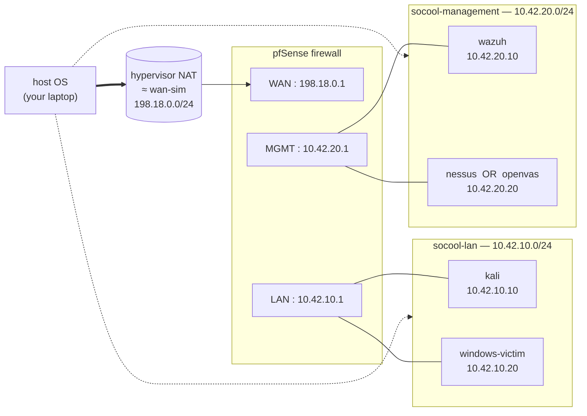

# Network topology

SOCool's lab runs on **three isolated networks**. All three are
host-only / internal to the hypervisor — **never bridged** to the
user's physical LAN by default. Bridged mode requires both
`SOCOOL_ALLOW_BRIDGED=1` and an interactive re-confirmation in
`setup.sh` / `setup.ps1`; the default path never touches it.

Source of truth for every CIDR and IP below: [`config/lab.yml`](../config/lab.yml).
Host-OS routing for VMs: [`docs/adr/0002-hypervisor-matrix.md`](./adr/0002-hypervisor-matrix.md).

## Diagram



Host connectivity: the dotted lines show that the host can reach VMs
on the lab's host-only networks (required for admin access — Wazuh
dashboard, pfSense web UI, Kali SSH). The networks themselves do
not bridge to the host's physical interface.

## Segment summary

| Segment | CIDR | Who lives here | Role |
|---|---|---|---|
| `wan-sim` | `198.18.0.0/24` | pfSense WAN interface | Simulated Internet. Uses the RFC 2544 benchmark range so accidental escape cannot hit real Internet. Served by the hypervisor's NAT gateway. |
| `socool-lan` | `10.42.10.0/24` | Kali (`.10`), Windows victim (`.20`), pfSense LAN (`.1`) | Attacker + victim subnet |
| `socool-management` | `10.42.20.0/24` | Wazuh (`.10`), Nessus or OpenVAS (`.20`), pfSense MGMT (`.1`) | SIEM + scanner out-of-band |

## Firewall zones (pfSense seed policy)

pfSense boots with the policy in
[`packer/pfsense/http/config-seed.xml`](../packer/pfsense/http/config-seed.xml).
Rule precedence (top wins):

| # | Src | Dst | Action | Reason |
|---|---|---|---|---|
| 1 | `lan` | any | **allow** | Attacker needs egress for realistic traffic |
| 2 | `lan` | `management` | **block** | Attacker must NOT reach SIEM or scanner directly |
| 3 | `management` | any | **allow** | SIEM/scanner need outbound for package updates & agent enrolment |
| 4 | `wan` | any | **block** (default deny) | Simulated Internet is hostile-by-default |

webConfigurator is bound to the `management` interface only. The
`wan` interface never exposes pfSense's admin UI.

## Which interface is which NIC in Vagrant

For VirtualBox and libvirt, the primary NIC (NIC 0) is always
Vagrant's default NAT NIC; Vagrant uses it for SSH and we use it on
pfSense as the `wan-sim` interface. Additional `:private_network`
NICs are wired per [`vagrant/Vagrantfile`](../vagrant/Vagrantfile):

| VM | NIC 0 | NIC 1 | NIC 2 |
|---|---|---|---|
| pfsense | NAT (= WAN) | `socool-lan` (10.42.10.1) | `socool-management` (10.42.20.1) |
| kali | NAT | `socool-lan` (10.42.10.10) | — |
| windows-victim | NAT | `socool-lan` (10.42.10.20) | — |
| wazuh | NAT | `socool-management` (10.42.20.10) | — |
| nessus / openvas | NAT | `socool-management` (10.42.20.20) | — |

### Default route — known caveat

Non-pfSense VMs have two NICs (NAT + host-only). Their default
route currently goes through the NAT NIC — which means Kali's
outbound Internet bypasses pfSense, unlike a real attacker-in-a-LAN.
For a realistic traffic-flow lab, set the default gateway to
pfSense's LAN IP (`10.42.10.1`) via a Packer provisioner. This is
flagged in each VM's `packer/<vm>/README.md` as a tuning item.

## Verification

From the host:

```bash
# Each VM reachable on its host-only IP?
for ip in 10.42.10.1 10.42.10.10 10.42.10.20 10.42.20.1 10.42.20.10 10.42.20.20; do
    timeout 3 bash -c "</dev/tcp/$ip/22" 2>/dev/null && echo "$ip OK" || echo "$ip unreachable"
done

# Primary services:
bash tests/smoke/test-smoke.sh    # with SOCOOL_LAB_UP=1
```

From inside Kali (the isolation guarantee):

```bash
vagrant ssh kali -c 'timeout 3 bash -c "</dev/tcp/10.42.20.10/443"'
#   expected: connection timed out (pfSense rule #2 blocks it)
#   if succeeds: the filter is broken; see docs/troubleshooting.md#network
```

## Changing CIDRs or adding a segment

1. Edit `config/lab.yml` (the single source of truth).
2. Bump the schema version if the shape (not values) changed, per
   [`.skills/software-architect/SKILL.md`](../.skills/software-architect/SKILL.md).
3. Every place that hard-references a CIDR must be updated in lock-step:
   pfSense `config-seed.xml`, `docs/network-topology.md` (this file),
   `README.md`, `.skills/devops/SKILL.md`.
4. Run `bash tests/run-all.sh` — the parity and preflight suites
   catch several of the obvious drifts.
